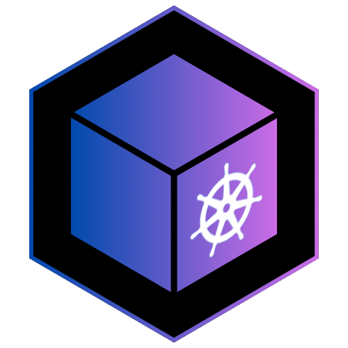

<!-- [![Forks][forks-shield]][forks-url] -->
<!-- [![Stargazers][stars-shield]][stars-url] -->
<!-- [![Issues][issues-shield]][issues-url] -->
[![GPL][license-shield]][license-url]

<!-- PROJECT LOGO -->
 

  

  <h3>Tesserakt TUI</h3>

  

    A stylish TUI for managing a Kubernetes cluster
    <!--   -->
    <!-- <a href="https://github.com/lucasaug/tesserakt-tui"><strong>Explore the docs »</strong></a> -->
    <!--   -->
    <!--   -->
    <!-- <a href="https://github.com/lucasaug/tesserakt-tui">View Demo</a> -->
    <!-- · -->
    <!-- <a href="https://github.com/lucasaug/tesserakt-tui/issues/new?labels=bug&template=bug-report---.md">Report Bug</a> -->
    <!-- · -->
    <!-- <a href="https://github.com/lucasaug/tesserakt-tui/issues/new?labels=enhancement&template=feature-request---.md">Request Feature</a> -->
  

<!-- TABLE OF CONTENTS -->

  
Table of Contents

  <ol>
    <li>
      <a href="#about-the-project">About The Project</a>
    </li>
    <li>
      <a href="#getting-started">Getting Started</a>
      <ul>
        <li><a href="#prerequisites">Prerequisites</a></li>
        <li><a href="#usage">Usage</a></li>
      </ul>
    </li>
    <li><a href="#roadmap">Roadmap</a></li>
    <li><a href="#license">License</a></li>
  </ol>

<!-- ABOUT THE PROJECT -->
## About The Project

Tesserakt-TUI is a Terminal User Interface for interacting with a Kubernetes cluster.
It is intended to be robust, fast and stylish.
 
 
[![Tesserakt-TUI Screen Shot][tesserakt-tui-screenshot]](https://example.com)

<!-- GETTING STARTED -->
## Getting Started

### Prerequisites

You need the Go compiler to build this repository.
This software was tested on version 1.22.5.

### Usage

1. Clone the repo
2. Run `go build`
3. Run `./tesserakt-tui`

Navigation is done using `hjkl` or the arrow keys. Pressing `Enter` when selecting a resource opens up it's JSON description.

<!-- ROADMAP -->
## Roadmap

- [x] Include Workload resources
- [x] Include cluster data
    - [x] Node count
    - [x] Cluster name
- [ ] Include more resources
- [ ] Enable filtering by name
- [ ] Enable filtering by namespace
- [ ] Enable editing and deleting a resource
- [ ] Enable viewing pod logs

<!-- LICENSE -->
## License

Distributed under the GPL 3.0 License. See `LICENSE` for more information.

<!-- MARKDOWN LINKS & IMAGES -->
<!-- https://www.markdownguide.org/basic-syntax/#reference-style-links -->
[forks-shield]: https://img.shields.io/github/forks/lucasaug/tesserakt-tui.svg?style=for-the-badge
[forks-url]: https://github.com/lucasaug/tesserakt-tui/network/members
[stars-shield]: https://img.shields.io/github/stars/lucasaug/tesserakt-tui.svg?style=for-the-badge
[stars-url]: https://github.com/lucasaug/tesserakt-tui/stargazers
[issues-shield]: https://img.shields.io/github/issues/lucasaug/tesserakt-tui.svg?style=for-the-badge
[issues-url]: https://github.com/lucasaug/tesserakt-tui/issues
[license-shield]: https://img.shields.io/github/license/lucasaug/tesserakt-tui.svg?style=for-the-badge
[license-url]: https://github.com/lucasaug/tesserakt-tui/blob/master/LICENSE.txt
[tesserakt-tui-screenshot]: images/screenshot.png

